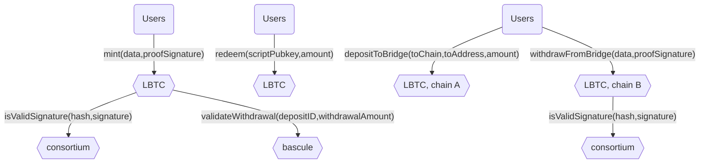

# Lombard Finance EVM smart-contracts
[Website](https://www.lombard.finance/) | [Docs](https://docs.lombard.finance/)


## Overview
LBTC is liquid Bitcoin; it's yield-bearing, cross-chain, and 1:1 backed by BTC. LBTC enables yield-bearing BTC to move cross-chain without fragmenting liquidity, and is designed to seamlessly integrate Bitcoin into the decentralized finance (DeFi) ecosystem while maintaining the security and integrity of the underlying asset.



### Addresses
#### Ethereum

| Smart contract    | Description                                                                    | Address                                                                                                               | ProxyAdmin                                                                                                            |
|-------------------|--------------------------------------------------------------------------------|-----------------------------------------------------------------------------------------------------------------------|-----------------------------------------------------------------------------------------------------------------------|
| Bascule           | Bascule drawbridge designed to prevent bridge hacks before they hit the chain. | [0xc750eCAC7250E0D18ecE2C7a5F130E3A765dc260](https://etherscan.io/address/0xc750eCAC7250E0D18ecE2C7a5F130E3A765dc260) | -                                                                                                                     |
| LombardConsortium | Stores consortium threshold key and verify signatures                          | [0xed6d647e2f81e5262101aff72c4a7bcdcfd780e0](https://etherscan.io/address/0xed6d647e2f81e5262101aff72c4a7bcdcfd780e0) | [0xa212Db18f8aEC6eF2F08cE42D7B447f9a405CD24](https://etherscan.io/address/0xa212Db18f8aEC6eF2F08cE42D7B447f9a405CD24) |
| LombardTimelock   | Safeguard helps to perform delayed transactions (implementation upgrade)       | [0x055E84e7FE8955E2781010B866f10Ef6E1E77e59](https://etherscan.io/address/0x055E84e7FE8955E2781010B866f10Ef6E1E77e59) | -                                                                                                                     |
| LBTC              | ERC20 token to interact with protocol                                          | [0x8236a87084f8B84306f72007F36F2618A5634494](https://etherscan.io/address/0x8236a87084f8B84306f72007F36F2618A5634494) | [0xbae061C73876952aa2C5e483B74DfA785425f879](https://etherscan.io/address/0xbae061C73876952aa2C5e483B74DfA785425f879) |
| GnosisSafeProxy   | Lombard governance and treasury wallet                                         | [0x251a604E8E8f6906d60f8dedC5aAeb8CD38F4892](https://etherscan.io/address/0x251a604E8E8f6906d60f8dedC5aAeb8CD38F4892) | -                                                                                                                     |


## Installation

### Prerequisites
* Node: v18+

### Tasks
#### Compilation
```bash
yarn hardhat compile
```
#### Tests
```bash
yarn hardhat test
```

### Deployment
Compile contracts before deployment
```bash
yarn hardhat compile
```
#### Proxy factory
Deploy proxy factory from zero nonce account
```bash
yarn hardhat deploy-proxy-factory --network '$NETWORK'
```

#### Core contracts
Deploy consortium
```bash
yarn hardhat deploy-consortium --network '$NETWORK'
```

Deploy LBTC
```bash
yarn hardhat deploy-lbtc --consortium '$CONSORTIUM' --burn-commission 10000 --network '$NETWORK'
```

Configure smart-contracts:
*TBD*

##### Bridge
Deploy adapter (e.g. Chain Link)
[Find router](https://docs.chain.link/ccip/supported-networks)
```bash
yarn hardhat deploy-chainlink-adapter --router '$ROUTER_ADDR' --lbtc '$LBTC_ADDR' --network '$NETWORK'
```
Deploy bridge
```bash
yarn hardhat deploy-bridge --lbtc '$LBTC_ADDR' --treasury '$TREASURY_ADDR'  --adapter '$ADAPTER_ADDR' --set-bridge --network '$NETWORK'
```
Deploy token pool
```bash
yarn hardhat deploy-ccip-token-pool --router '$ROUTER_ADDR' --lbtc '$LBTC_ADDR' --adapter '$ADAPTER_ADDR' --rmn '$RMN_ADDR' --network '$NETWORK'
```
Configure smart-contracts:
1. Add destinations using `addDestinations` of **Bridge** smart-contract.
2. *Claim the ownership of the token pool / register it in Chainlink*
3. *Connect token pools from different chains with addChainUpdates*
4. *TBD*
