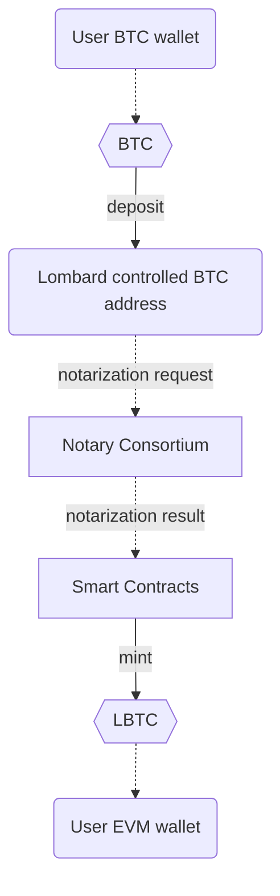
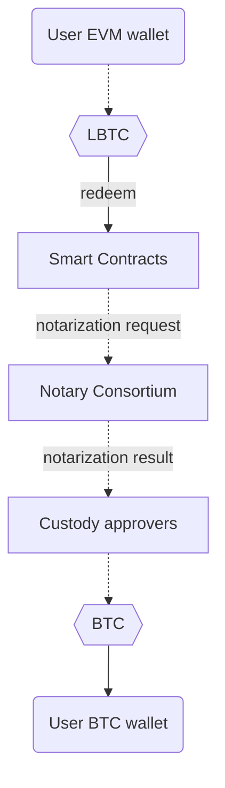

<div>
    
    
    =18-node.js-green">
    =4.5.0-typescript-blue">
    
    
</div>

<div>
    
</div>

# Lombard Finance EVM smart-contracts
[Website](https://www.lombard.finance/) | [Docs](https://docs.lombard.finance/)

## Content
1. [Overview](https://github.com/lombard-finance/evm-smart-contracts?tab=readme-ov-file#overview)
2. [One-time setup](https://github.com/lombard-finance/evm-smart-contracts?tab=readme-ov-file#one-time-setup)
3. [Deployment](https://github.com/lombard-finance/evm-smart-contracts?tab=readme-ov-file#deployment)
4. [Audit](https://github.com/lombard-finance/evm-smart-contracts?tab=readme-ov-file#audit)
5. [Misc](https://github.com/lombard-finance/evm-smart-contracts?tab=readme-ov-file#misc)

## Overview
LBTC is liquid Bitcoin; it's yield-bearing, cross-chain, and 1:1 backed by BTC. LBTC enables yield-bearing BTC to move cross-chain without fragmenting liquidity, and is designed to seamlessly integrate Bitcoin into the decentralized finance (DeFi) ecosystem while maintaining the security and integrity of the underlying asset.

| Smart contract   | Description                                                                                                                            |
|------------------|----------------------------------------------------------------------------------------------------------------------------------------|
| Bascule          | Bascule drawbridge designed to prevent bridge hacks before they hit the chain.                                                         |
| Consortium       | The contract utilizes notary consortium multi-signature verification.                                                                  |
| LombardTimelock  | Safeguard helps to perform delayed transactions (e.g. implementation upgrade).                                                         |
| LBTC             | ERC20 token to interact with protocol.                                                                                                 |
| GnosisSafeProxy  | Lombard governance, pauser and treasury wallets.                                                                                       |      
| Bridge           | Lombard multi-factor bridge. Supports different adapters (like [CCIP](https://docs.chain.link/ccip) as second factor to bridge `LBTC`. |
| OFTAdapters      | LayerZero adapters for `LBTC` with different strategies.                                                                               |
| ProxyFactory     | CREATE3 factory allows to deploy proxies with same address.                                                                            |
| FBTCPartnerVault | Allows to stake `FBTC` token.                                                                                                          |
| PMMs             | Swap pools to accept wrapped BTC ERC20 tokens (like `cbBTC` and `BTCb`).                                                               |
| PoR              | Bitcoin addresses storage with the ownership proof system.                                                                             |
| StakeAndBake     | Convenience contract for users who wish to stake their `BTC` and deposit `LBTC` in a vault in the same transaction.                    |


### BTC deposit flow
Graph below represents BTC to LBTC flow



### BTC redeem flow
Graph below represents LBTC to BTC flow


## One-time setup

Install [nodejs](https://nodejs.org/en/download/package-manager). Run node -v to check your installation.

Support Node.js 18.x and higher.

### 1. Clone this repo:
```bash
git clone https://github.com/lombard-finance/evm-smart-contracts.git
```
### 2. Install dependencies
```bash
yarn
```

### 3. Compile smart contracts

```bash
yarn hardhat compile
```

### 4. Run tests

```bash
yarn hardhat test
```

## Deployment

Learn available scripts:
```bash
yarn hardhat
```

* `deploy-*` - scripts to deploy smart-contracts.
* `setup-*` - scripts to setup or change configuration of smart-contracts.
* `upgrade-proxy` - script to upgrade existing proxy with new implementation.

## Audit

Find the latest audit reports in [docs/audit](https://github.com/lombard-finance/evm-smart-contracts/tree/main/docs/audit)

## Misc

Follow [docs](https://github.com/lombard-finance/evm-smart-contracts/tree/main/docs) in more in-depth study of contracts.