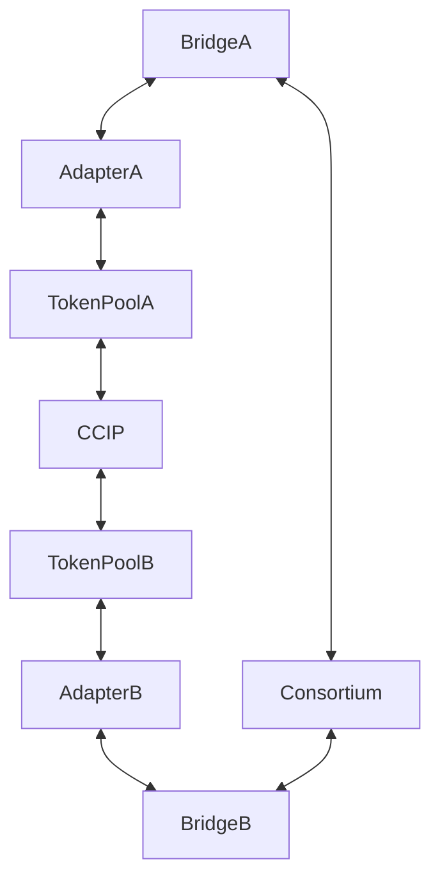

# Lombard EVM bridge contracts

## Bridge with CCIP adapters

## Summary:
* `Bridge.sol` - Consortium compatible bridge for 2-factor LBTC bridging.
* `adapters` - Adapters to use as security factor for `Bridge.sol`.
  * `CLAdapter.sol` - CCIP adapter.
  * `TokenPool.sol` - custom **TokenPool** deployed by `CLAdapter.sol`.
* `oft` - LayerZero OFT Adapters (independent from `Bridge.sol`).
  * `EfficientRateLimitedOFTAdapter.sol` - abstract OFT Adapter implements bidirectional rate limits.
  * `LBTCOFTAdapter.sol` - **Lock/Unlock** implementation derived from `EfficientRateLimitedOFTAdapter.sol` with ability to migrate to **Burn/Mint**.
  * `LBTCBurnMintAdapter.sol` - **Mint/Burn** implementation derived from `EfficientRateLimitedOFTAdapter.sol`.