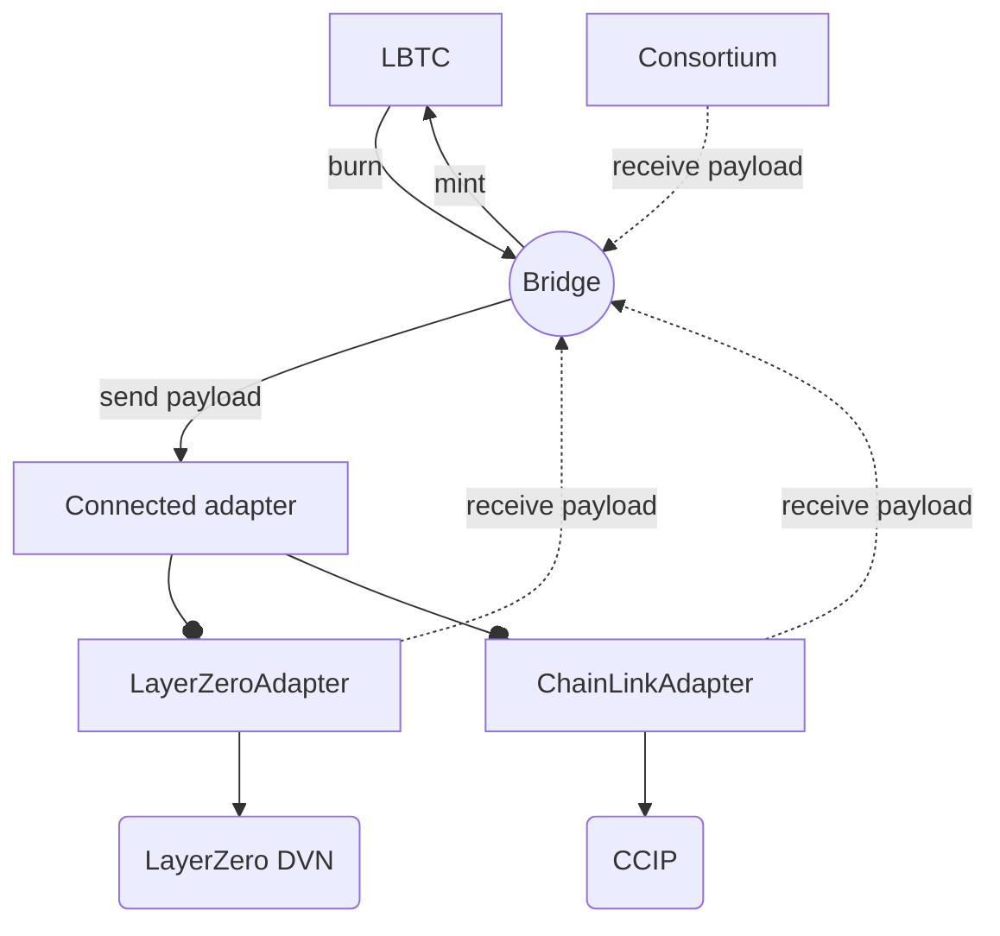

```mermaid
flowchart TB
    LBTC -- burn --> bridge((Bridge)) -- mint --> LBTC
    bridge -- send payload --> id3[Connected adapter]
    id3 --o id4[LayerZeroAdapter] --> id1(LayerZero DVN)
    id3 --o id5[ChainLinkAdapter] --> id2(CCIP)
    
    id4 -. receive payload .-> bridge
    id5 -. receive payload .-> bridge
    
    Consortium -. receive payload .-> bridge
```